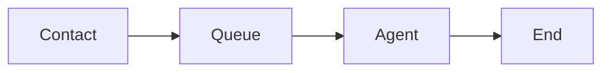

# Conto contact center simulator

Conto is a free and open source contact simulator built with Python using SimPy. It simulates the behavior of a contact center, where customers arrive to the system, wait in a queue to be served by an agent, and then leave the system.

## Goals

I wanted a toy simulator to serve as a learning aid to visualize the activity of a contact center or to provide a playground for experimenting with different contact center strategies and setups.

This is primarily learning project to familiarize myself with SimPy and practice working with Python in an application building context. Eventually I'll implement the visualizer in a web frontend.

A Python simulation on the backend is obviously not an ideal architecture, but it's serves my learning goals.

## Contact flow

A contact arrives, waits in a queue, and is served by an agent. The agent then ends the contact.

Contacts may abandon (disconnect before reaching an agent) if they wait too long in the queue. Agents may also place a contact on hold.

### Future features

* Skill-based routing
* Skill and agent transfers
* Mixed media contacts (email, chat, etc.)
* Outbound dialers
* Outages
