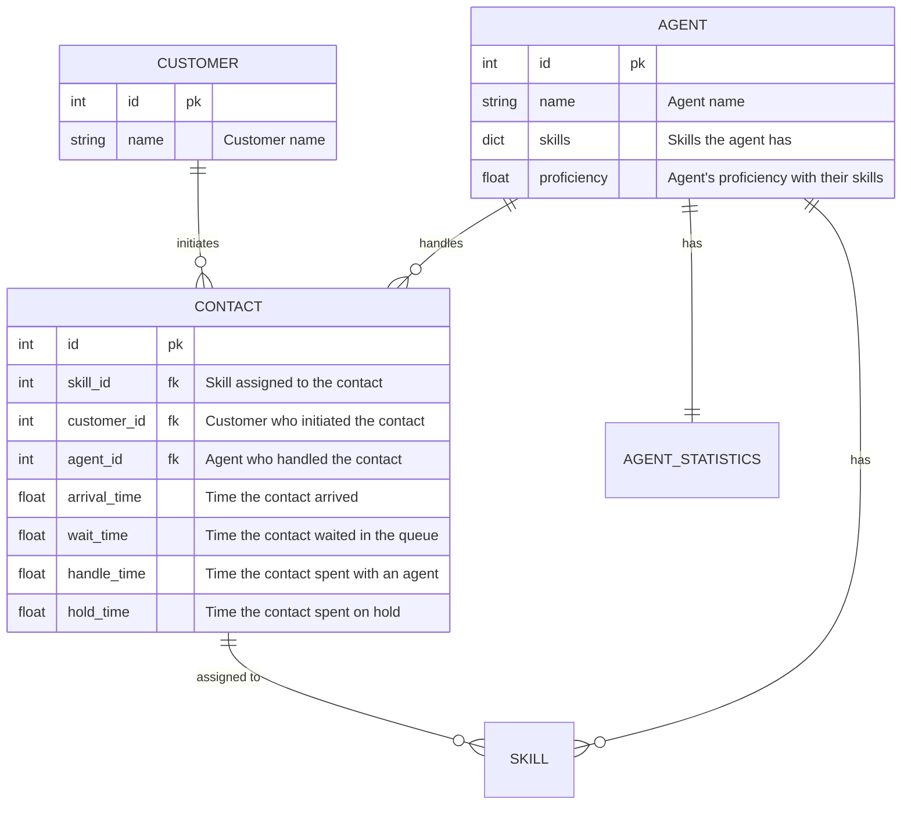
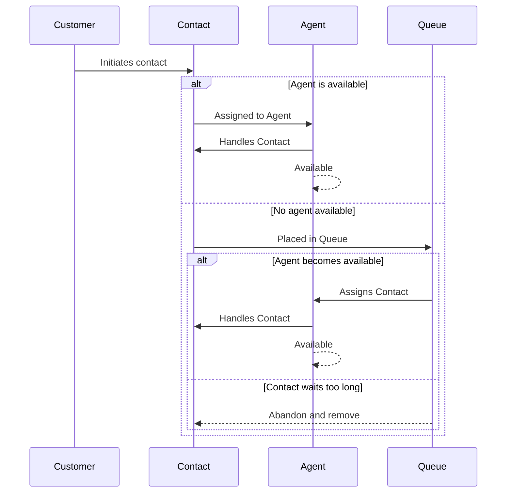
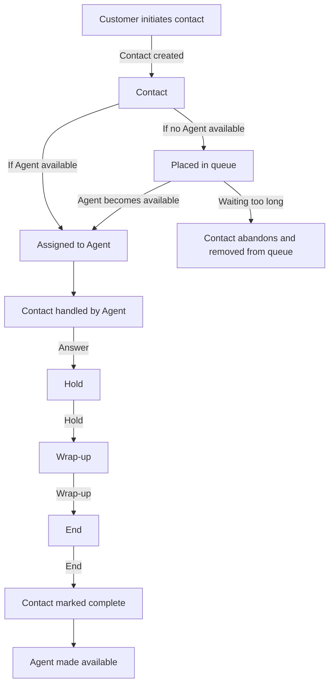

## Entity Relationship Diagram

## Contact flow

1. A `Contact` object is created when a `Customer` initiates a contact.
2. If an `Agent` is available, the `Contact` is assigned to that `Agent`. Otherwise, the `Contact` is placed in a queue:
   1. When an `Agent` becomes available, the `Contact` is assigned to the `Agent`.
   2. If the `Contact` has been waiting for too long, it abandons and is removed from the queue.
3. The `Contact` is handled by an `Agent`:
   1. Answer
   2. Hold (optional)
   3. Wrap-up
   4. End
4. The `Contact` is marked complete and the `Agent` is made available.

