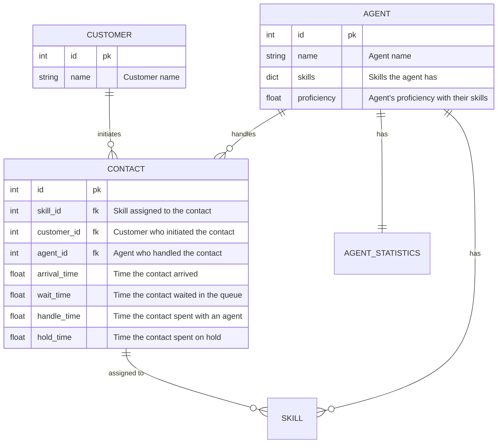

```mermaid
erDiagram
    CUSTOMER ||--o{ CONTACT : initiates
    CUSTOMER {
        int id pk
        string name "Customer name"
    }
    CONTACT ||--o{ SKILL : "assigned to"
    CONTACT {
        int id pk
        int skill_id fk "Skill assigned to the contact"
        int customer_id fk "Customer who initiated the contact"
        int agent_id fk "Agent who handled the contact"
        float arrival_time "Time the contact arrived"
        float wait_time "Time the contact waited in the queue"
        float handle_time "Time the contact spent with an agent"
        float hold_time "Time the contact spent on hold"
    }
    AGENT {
        int id pk
        string name "Agent name"
        dict skills "Skills the agent has"
        float proficiency "Agent's proficiency with their skills"
    }
    AGENT ||--o{ SKILL : has
    AGENT ||--o{ CONTACT : handles
    AGENT ||--|| AGENT_STATISTICS : has

```
